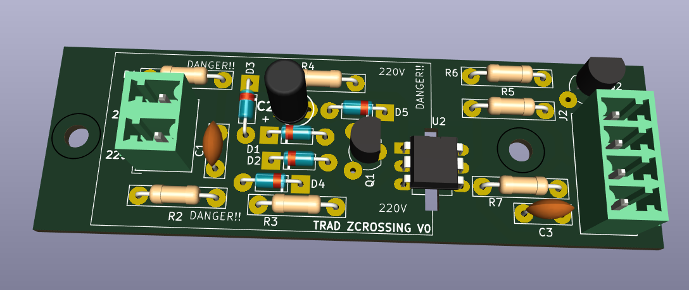
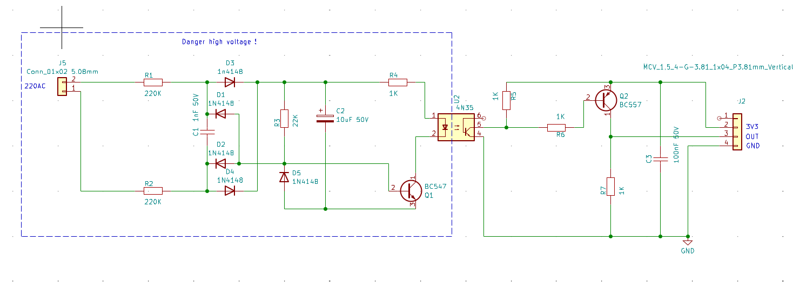
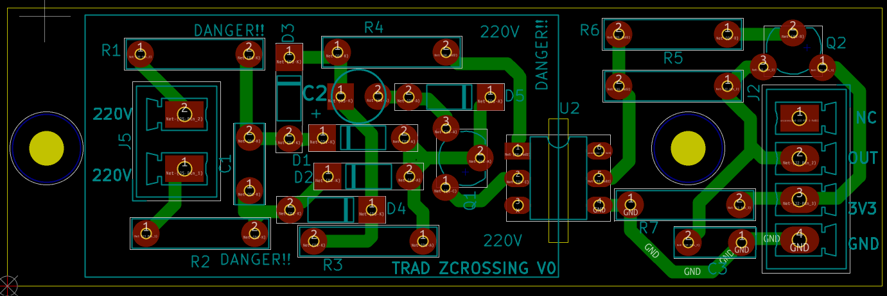
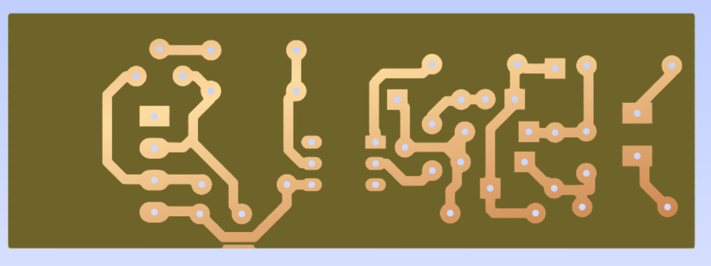
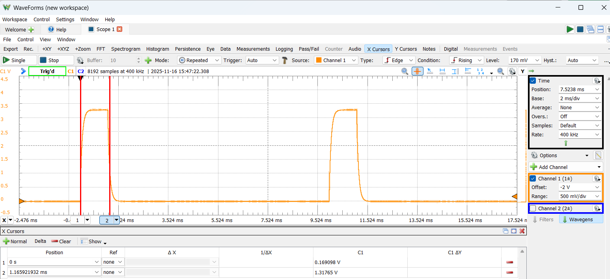
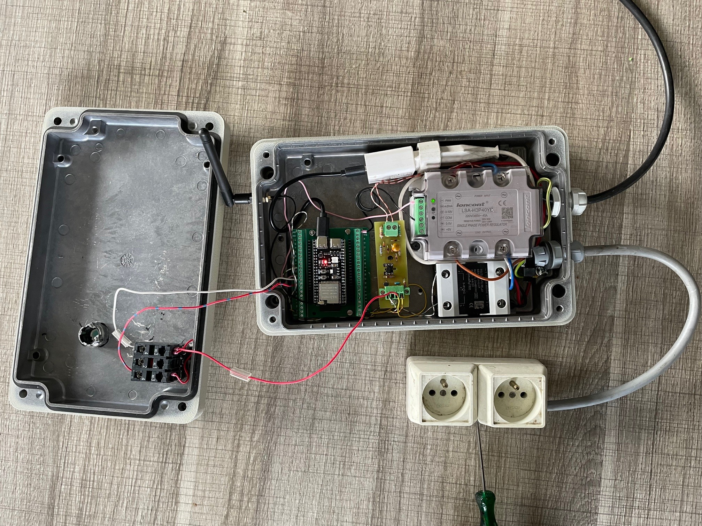
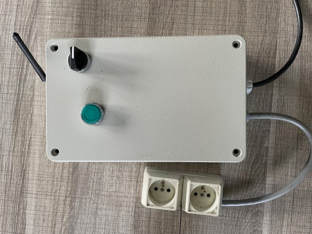
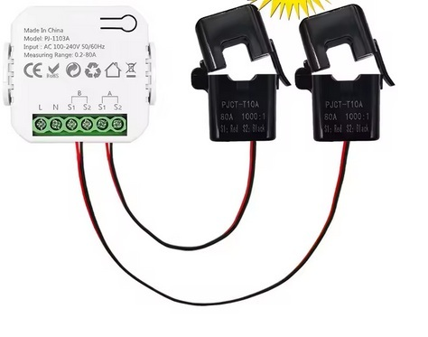

**Detecteur de passage à 0V**  
Montage avec composants trad. et pcb "simple face" maximalisé pour realisation home-made à la fraiseuse ou par gravure chimique 
Le projet Kicad complet est fourni 

relevé:

Ce montage a été integré dans mon router solaire pour commander la seconde voie utilisant le SSR. 
La premiere voie utilise le SSL commandé en PWM (la detection de passage a 0 est integré dans le SSL).

Le logiciel de gestion est une version modifié de YARSOL .  
La modification consiste principalement en un module de communication directe vers Tuya ("wifi bidirectional meter") placé dans mon tableau electrique pour acceder à la consomation de la maison.
   
Le rafraississement des informations de puissance se fait toutes les 3 secondes par wifi  (limite du module tuya), et ne necesssite pas l'utilisation de home assistant ou de serveur MQTT.   
